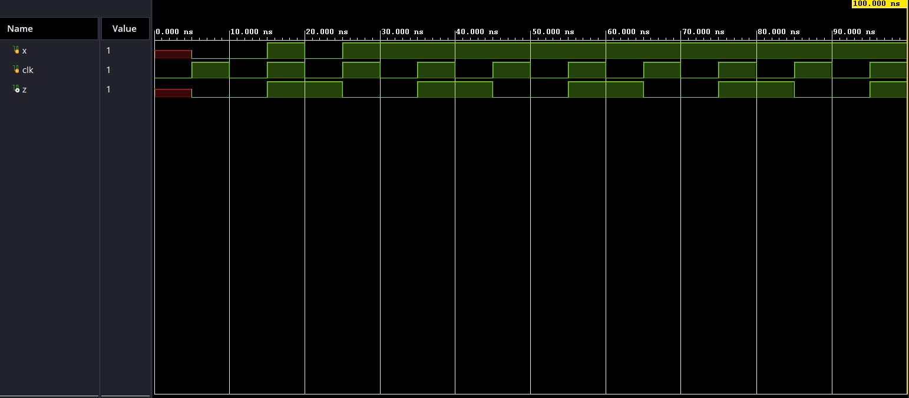
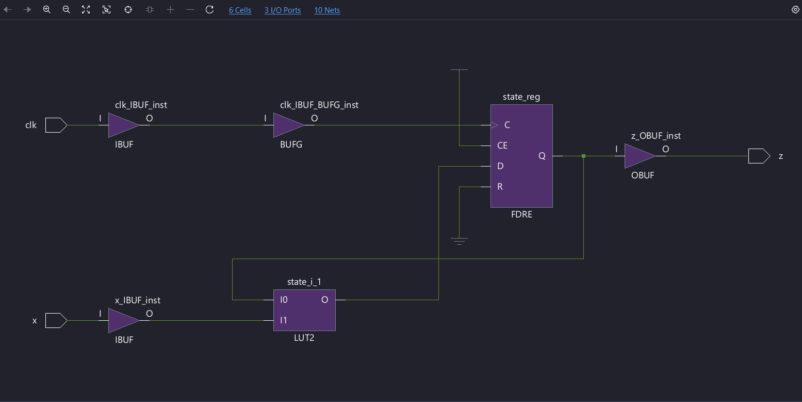

# Parity Generator – FSM

## Overview

This project implements a **Parity Generator using a Finite State Machine (FSM)** in Verilog.

The design generates the parity of a serial input data stream using two states:

- EVEN
- ODD

The FSM changes its state whenever an input bit `1` is received.

## Design

### Inputs

- `clk` – Clock signal
- `x` – Serial input data

### Output

- `z` – Generated parity output

### States

| State | Meaning |
|-------|---------|
| EVEN | Even number of 1s received |
| ODD | Odd number of 1s received |

### State Transition

- From `EVEN`:
  - `x = 0` → Remain in `EVEN`
  - `x = 1` → Move to `ODD`

- From `ODD`:
  - `x = 0` → Remain in `ODD`
  - `x = 1` → Move to `EVEN`

## Files

| File | Description |
|------|-------------|
| `parity.v` | RTL implementation of the FSM parity generator |
| `parity_tb.v` | Verilog testbench for simulation |
| `waveform.png` | Simulation waveform |
| `synthesized-design.png` | Synthesized design |

## Simulation

The design was simulated using a Verilog simulator and the output waveform was verified for different input sequences.

### Simulation Waveform

## Synthesis

The RTL design was synthesized to verify the resulting hardware implementation.

### Synthesized Design

## Concepts Used

- Finite State Machine (FSM)
- Sequential Logic
- State Encoding
- Verilog HDL
- RTL Design
- Testbench Development
- Simulation
- Logic Synthesis

## Author

**Ram54a**

ECE | VLSI | RTL Design | Design Verification
